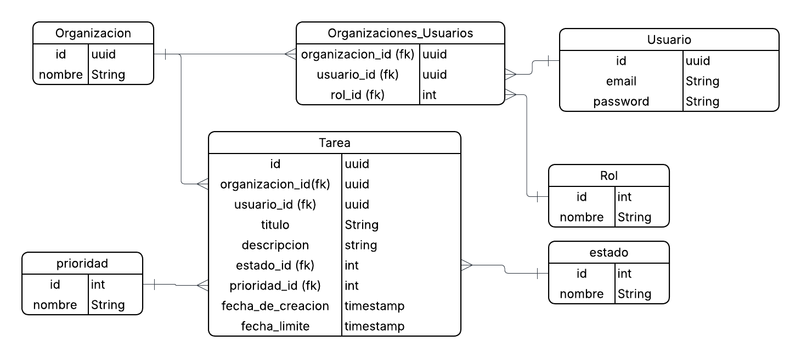

# PruebaTecnica_Multitenant

API REST de un sistema mínimo de gestión de tareas para múltiples organizaciones (multi-tenant). Cada organización tiene sus propios usuarios y sus propias tareas, completamente aisladas de las demás.

## Stack

- **Lenguaje:** C# (.NET 8)
- **Framework:** ASP.NET Core Web API
- **ORM:** Entity Framework Core 8
- **Base de datos:** PostgreSQL
- **Auth:** JWT Bearer
- **Docs:** Swagger / OpenAPI

---

## Requisitos previos

| Herramienta | Versión mínima | Verificar |
|---|---|---|
| .NET SDK | 8.0 | `dotnet --version` |
| PostgreSQL | 14+ | `psql --version` |
| EF Core CLI | cualquiera | `dotnet ef --version` |

Si no tienes la herramienta de EF Core instalada:

```bash
dotnet tool install --global dotnet-ef
```

---

## Pasos para correr el proyecto desde cero

### 1. Clonar el repositorio

```bash
git clone <url-del-repositorio>
cd PruebaTecnica_Multitenant
```

### 2. Configurar la cadena de conexión y JWT

Edita el archivo `src/PruebaTecnica_Multitenant.API/appsettings.json` con tus credenciales de PostgreSQL:

```json
{
  "ConnectionStrings": {
    "DefaultConnection": "Host=localhost;Port=5432;Database=prueba_multitenant;Username=postgres;Password=TU_CONTRASEÑA"
  },
  "Jwt": {
    "Secret": "Elonepieceesreaaaaaaaaaaaaaaaaaaaaaaaaaaaaaaaaaaaaaaaaaaaaaaaaaaaaaaaaaaaaaal",
    "Issuer": "PruebaTecnica",
    "Audience": "PruebaTecnica",
    "ExpiryMinutes": 60
  }
}
```

> La base de datos `prueba_multitenant` no necesita existir previamente; EF Core la crea con la migración.

### 3. Aplicar las migraciones

Desde la raíz del repositorio:

```bash
dotnet ef database update --project src/PruebaTecnica_Multitenant.API
```

Esto crea la base de datos y todas las tablas. Al arrancar la aplicación por primera vez, el **DataSeeder** inserta automáticamente los datos de prueba.

### 4. Correr el proyecto

```bash
dotnet run --project src/PruebaTecnica_Multitenant.API
```

### 5. Abrir Swagger

Una vez que el servidor esté corriendo, abre en tu navegador:

```
https://localhost:7025/swagger
```

> El puerto puede variar. Revisa la salida de `dotnet run` si `7025` no funciona — busca la línea `Now listening on: https://localhost:XXXX`.

---

## Flujo de autenticación

1. **Registro** — `POST /api/auth/register` crea un usuario y una organización. Devuelve un JWT listo para usar.
2. **Login con una organización** — `POST /api/auth/login` devuelve directamente el JWT.
3. **Login con múltiples organizaciones** — `POST /api/auth/login` devuelve un `selectionToken` (válido 5 min) y la lista de organizaciones. Usa `POST /api/auth/login/organizacion` con el `selectionToken` y el `organizacionId` elegido para obtener el JWT final.

En Swagger, haz clic en **Authorize** (candado) y pega el JWT con el prefijo `Bearer <token>`.

---

## Datos del Seeder

Contraseña de todos los usuarios: **`Password123!`**

### Organización 1 — Alpha Corp

| Email | Rol en Org |
|---|---|
| alice@example.com | Admin |
| bob@example.com | Admin |
| carol@example.com | Miembro |
| david@example.com | Miembro |

### Organización 2 — Beta Solutions

| Email | Rol en Org |
|---|---|
| eve@example.com | **Admin** |
| frank@example.com | Admin |
| grace@example.com | Miembro |
| henry@example.com | Miembro |

### Organización 3 — Gamma Labs

| Email | Rol en Org |
|---|---|
| ivan@example.com | Admin |
| julia@example.com | Admin |
| karen@example.com | Miembro |
| eve@example.com | **Miembro** |

> **Caso especial:** `eve@example.com` pertenece a **dos** organizaciones con roles distintos — Admin en Beta Solutions y Miembro en Gamma Labs. Al hacer login, la API devuelve un `selectionToken` para que elija la organización.

### Tareas de ejemplo

| Organización | Asignada a | Título | Estado | Prioridad |
|---|---|---|---|---|
| Alpha Corp | carol | Diseñar logo corporativo | Pendiente | Alta |
| Alpha Corp | david | Revisar contratos Q2 | En Progreso | Media |
| Alpha Corp | carol | Entregar informe Q1 | Completada | Baja |
| Beta Solutions | grace | Configurar servidor de producción | Pendiente | Alta |
| Beta Solutions | henry | Actualizar documentación API | En Progreso | Media |
| Beta Solutions | grace | Deploy versión 2.0 | Completada | Alta |
| Gamma Labs | karen | Análisis de segmentación de clientes | Pendiente | Media |
| Gamma Labs | eve | Reunión con cliente estratégico | En Progreso | Alta |
| Gamma Labs | karen | Reporte mensual de métricas | Completada | Baja |

---

## Reglas de negocio principales

- **Admin** puede ver, crear, editar y eliminar cualquier tarea de su organización, y ver todos los usuarios.
- **Miembro** puede ver todas las tareas de su organización, pero solo crear y editar las suyas propias.
- Solo **Admin** puede eliminar tareas (`DELETE /api/tareas/{id}`).
- Una tarea en estado **Completada** no puede cambiar de estado.
- `usuarioId` en `POST /api/tareas` es opcional: si no se envía, la tarea se asigna automáticamente al usuario autenticado.
- Todas las consultas están aisladas por organización mediante el claim `org` del JWT.

---

## Decisiones de diseño

El diagrama de bd fue completamente decisión propia sin ayuda de IA.


Esta sección documenta las decisiones arquitectónicas y técnicas tomadas durante el desarrollo, separando lo que estaba definido en el enunciado de lo que fue criterio propio.

### Modelo de datos: tabla de unión en lugar de campo directo

El enunciado define al usuario con organización y rol como campos directos (`Usuario (id, organización, email, password, rol)`). Se decidió separar esa relación en una tabla `OrganizacionesUsuarios` con llave primaria compuesta `(organizacion_id, usuario_id)`.

La razón es que un usuario puede pertenecer a más de una organización con roles distintos. Con un campo directo en el usuario eso no sería posible sin duplicar registros. La tabla de unión centraliza las membresías en una sola cuenta, lo que es más limpio y escalable.

### Aislamiento multi-tenant a nivel de query

En lugar de usar schemas separados por tenant en la base de datos o un middleware que intercepte todas las peticiones, el aislamiento se aplica directamente en cada consulta filtrando por el `orgId` extraído del JWT (`WHERE organizacion_id = :orgId`).

Esta decisión permite que un mismo usuario pertenezca a varias organizaciones bajo la misma cuenta, algo imposible si el aislamiento fuera a nivel de schema o conexión. Además, hace explícito en el código qué datos ve cada request, lo que facilita auditar y razonar sobre la seguridad del sistema.

### Flujo de dos tokens para login multi-org

El enunciado pide únicamente `POST /auth/login — devuelve JWT`. Se extendió ese flujo con un `selectionToken` intermedio cuando el usuario pertenece a más de una organización.

Sin esta extensión, el login devolvería el JWT de la primera organización que saliera en la consulta, sin darle al usuario la posibilidad de elegir. El `selectionToken` tiene expiración de 5 minutos y no contiene los claims `org` ni `role`, por lo que no puede usarse para acceder a ningún endpoint protegido — su único propósito es confirmar la identidad del usuario el tiempo suficiente para que seleccione su organización.

### Protección con `RequireClaim("org")` en la policy por defecto

Esta decisión surgió al descubrir que usar el `selectionToken` como JWT en el header de Authorize causaba un error 500 interno, porque `User.GetOrgId()` intentaba parsear un claim `org` que no existía en ese token.

La solución fue agregar `RequireClaim("org")` a todas las políticas de autorización (incluyendo la default). Así, cualquier token sin ese claim recibe un 401 en lugar de romper el servidor. Garantiza además que el `selectionToken` no pueda usarse para hacer bypass a ningún endpoint.

### Filtros de tareas disponibles para ambos roles

El enunciado menciona "filtros por estado y por asignado" sin especificar si eso aplica solo al Admin. Se decidió que ambos roles puedan filtrar por los dos campos.

La razón es que un Miembro puede depender del trabajo de sus compañeros: si necesita saber si una tarea bloqueante ya está completada, tiene que poder buscarla por estado o por asignado sin tener que preguntarle a alguien más.

### `usuarioId` opcional al crear una tarea

El enunciado no define este comportamiento. Se decidió que si el campo `usuarioId` no se envía en `POST /tareas`, la tarea se asigna automáticamente al usuario autenticado.

Esto simplifica la experiencia para los Miembros, que en la mayoría de casos van a crear tareas para sí mismos, sin necesidad de consultarle a otra API su propio ID. Para el Admin la funcionalidad completa sigue disponible: puede enviar el `usuarioId` de cualquier miembro de la organización.

### Validación de `FechaLimite` futura

No estaba en los requisitos. Se agregó la validación de que `FechaLimite` sea una fecha posterior al momento de la petición para evitar crear tareas con fechas ya vencidas, lo que generaría datos inconsistentes desde el momento de inserción.

### PostgreSQL sobre SQL Server

El enunciado permitía ambas opciones. Se eligió PostgreSQL por su mayor capacidad de escalamiento y por su soporte nativo de Row-Level Security, que en un sistema multi-tenant real sería una segunda capa de aislamiento a nivel de base de datos, además del aislamiento que ya aplica la aplicación.

---

## Uso de inteligencia artificial

Este proyecto fue desarrollado con asistencia de Claude (Anthropic) como herramienta de pair programming a través de Claude Code. Esta sección describe honestamente qué fue de autoría propia y cómo se usó la IA.

### Qué fue decisión y diseño propio

- La arquitectura multi-tenant: decidir filtrar por `orgId` en cada query en lugar de schemas separados, y el porqué de esa elección.
- El modelo de datos: separar organización y rol en una tabla de unión en lugar de seguir literalmente el enunciado, para soportar usuarios en múltiples organizaciones.
- El flujo de dos tokens para login multi-org: identificar el problema (un usuario con varias orgs no puede elegir si solo hay un JWT) y diseñar la solución con un token intermedio de corta vida.
- Las reglas de negocio extendidas: qué puede filtrar cada rol, por qué los Miembros ven todas las tareas de su org, que `usuarioId` sea opcional al crear.
- La decisión de seguridad `RequireClaim("org")`: detectar el problema al intentar usar el selectionToken como JWT normal y definir la solución correcta.
- La elección de PostgreSQL y el razonamiento detrás (escalamiento, Row-Level Security).
- La definición del seeder: el caso especial del usuario con dos roles distintos en dos organizaciones para demostrar la funcionalidad multi-org.

### Qué generó la IA

- El código de implementación: controllers, DTOs, configuración de EF Core, TokenService, políticas de autorización, DataSeeder, extensiones de ClaimsPrincipal.
- La configuración de Swagger con soporte JWT y XML docs.
- La estructura de archivos y namespaces del proyecto.
- La mayor parte de este README.

### Cómo fue la colaboración

El flujo de trabajo fue iterativo por fases. Se definía el objetivo de cada fase (por ejemplo: "implementar login multi-org"), se describía el comportamiento deseado y las restricciones, y la IA generaba el código. Cuando el output no coincidía con lo esperado o aparecían bugs (como el error 500 con el selectionToken), se describía el problema observado y se definía conjuntamente la causa y la solución antes de que la IA la implementara.

La IA no tomó decisiones de diseño de forma autónoma: en cada punto donde había una decisión arquitectónica, el criterio fue definido primero en la conversación y luego traducido a código.
